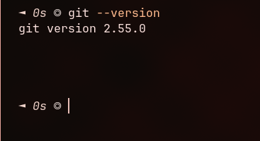
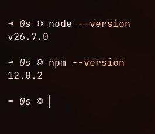

# **Praktikum Mentiapkan Memulai Pemrograman Mobile dengan React Native**

## **Tujuan Pembelajaran**

Setelah menyelesaikan modul praktikum ini,mahasiswa diharapkan mampu:
-Meginstal Git dan Github
-Menginstal Node.js dan NPM
-Menginstal Expo CLI
-Membuat project React Native
-Menjalankan Project React Native

1. Install Git di Local
    - unduh dan install Git via `sudo pacman -S git`
    - Verifikasi Git (buka cmd dan ketik "git --version")
    - 

2. Instal NodeJS dan NPM 
   - unduh dan install Git via `sudo pacman -Syu nodejs npm`
   - verifikasi Node JS (pa izin pake versi 26 )
   - 

3. Memulai Projek dengan Framework Expo
   - Buka Terminal pada code editor
   - Pastikan pada direkturi yang dituju
   - ketika (npx create-expo-app ptmn2 --template blank)
   - scan qr code dengan aplkasi expo go
   - jika ingin run emulator web ketik `npx expo install react-dom react-native-web`
   - ketik `npm expo start --web`
    

4. tugas 
   