# Modul Praktikum Pemrograman Mobile Pertemuanv3
## 🎯 Tujuan Pembelajaran

Setelah menyelesaikan praktikum ini, mahasiswa mampu:

1. Memahami dan menggunakan **16 Core Components** React Native
2. Menerapkan **StyleSheet** untuk styling terpusat
3. Menggunakan **useState** untuk state management dasar
4. Membuat layout yang responsif dengan **Flexbox**
5. Menangani **interaksi pengguna** (tekan, input, scroll)

LANGKAH 1 - Mengimpor Componenent

1. Buka file App.js pada folder projek ptmn2
2. import 16 core coomponent sebagai berikut:
3. Konfirmasi bukti
    - 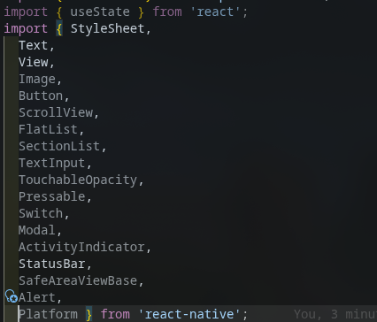

LANGKAH 2 - Menyiapkan data Objek dan Arrays
1. Membuat Objek untuk menyimpan data profile
2. Buat Objek Array bernama profile
3. Konfirmasi Bukti
    - 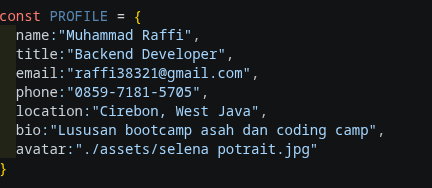
4. Membuat Objek Array Skill untuk menyimpan data SKILLS
5. Buat Objek skill
    - 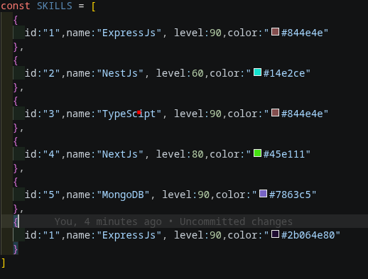
6. Buat objek setion
7. Konfirmasi bukti section
    - 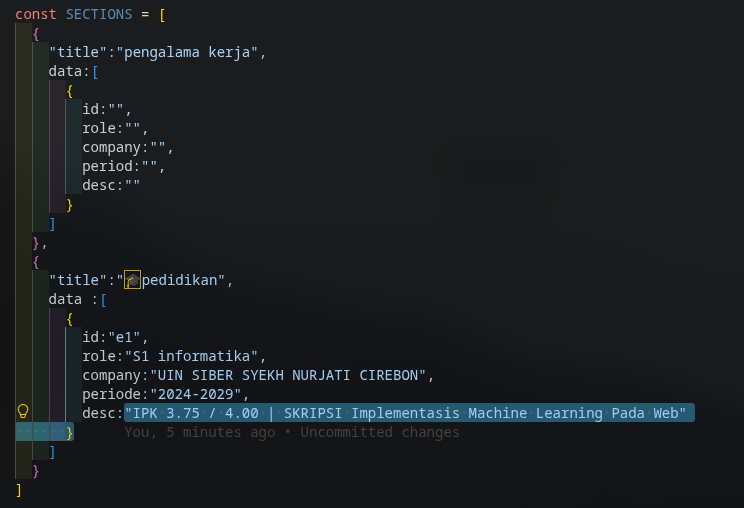
8. Buat array socials
9. Bukti
    - 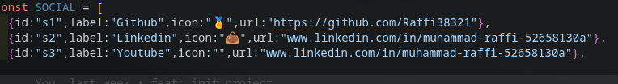
10. buat component skillcard
11. bukti
    - 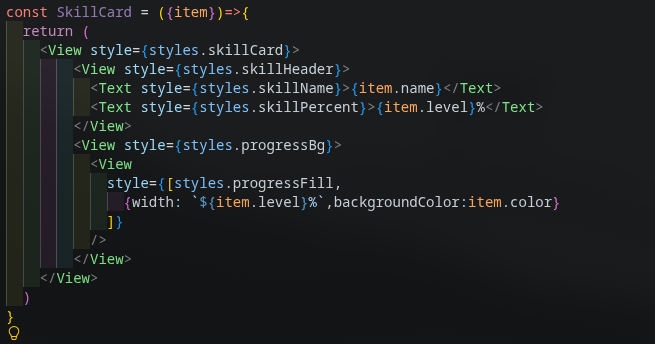
12. Buat component timelinecard
    - 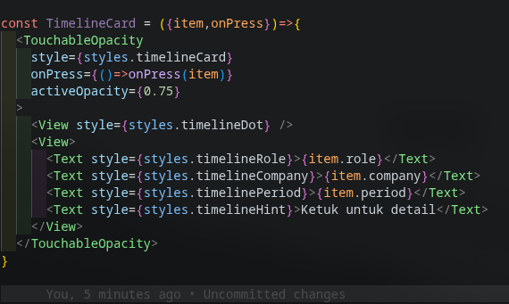
13. lengkapin fungsi di compnent app
    - 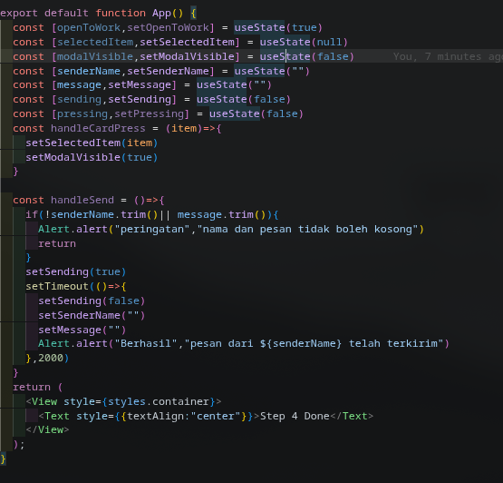
14. ganti component di app
15. bukti
    - 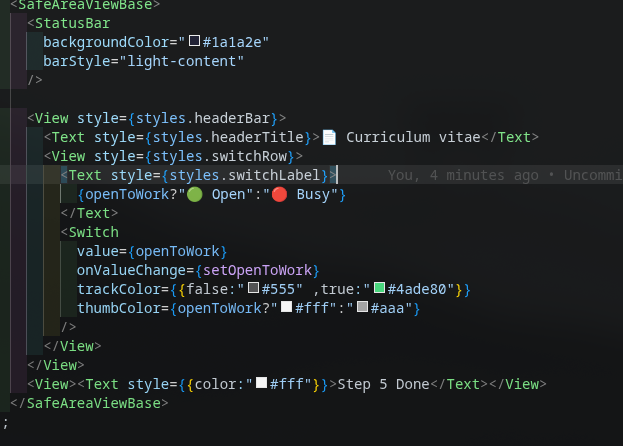
16. update component app
17. bukti
    - 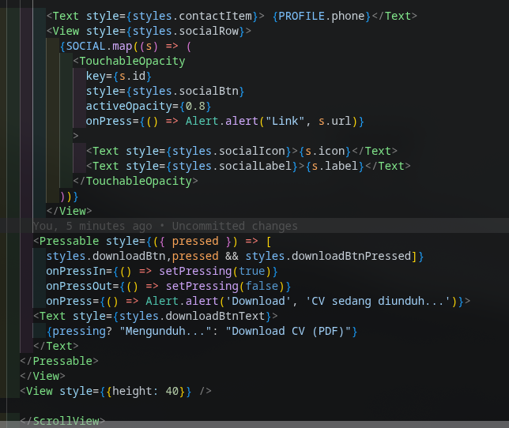
18. ssection keahlian
19. bukti
    - 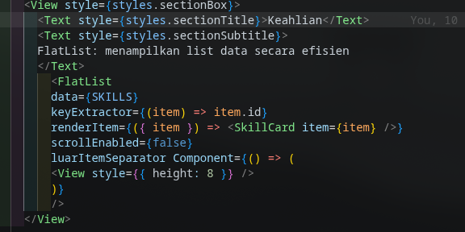
20. section riwayat
21. bukti
    - 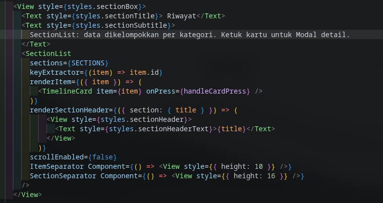
22. section contack me
23. bukti
    - 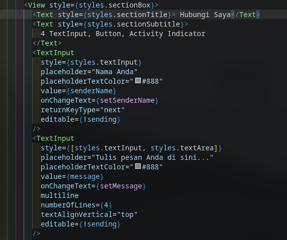
24. popup detail
25. bukti
    - 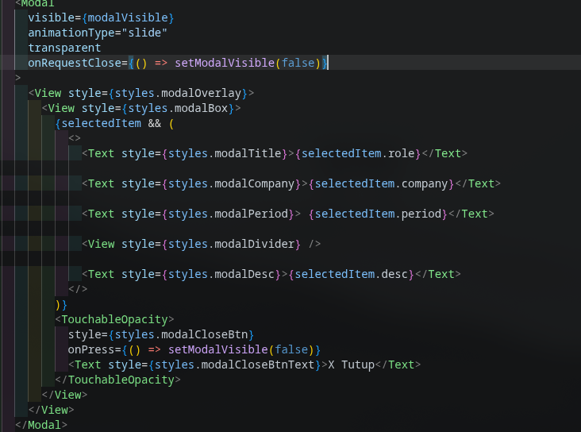
26. konstanta colors
27. bukti
    - 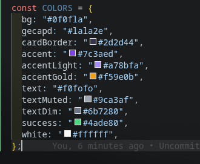
28. styling
29. bukti
    - 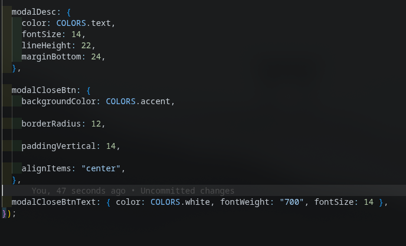