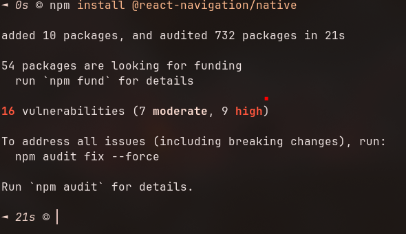
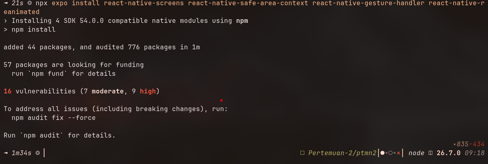
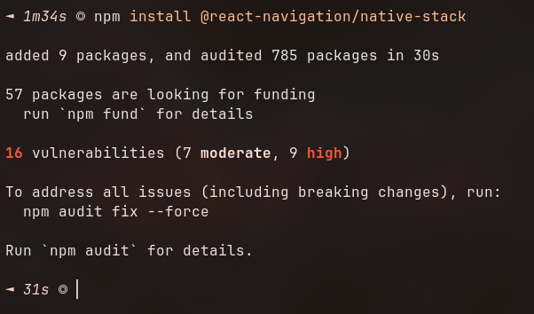
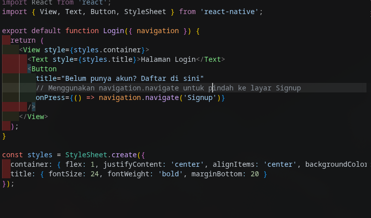
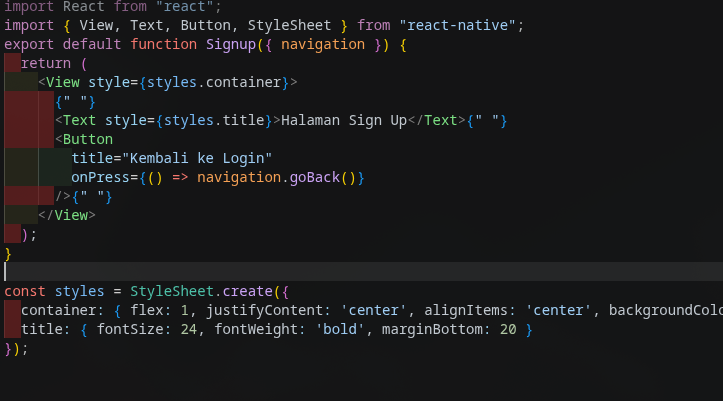
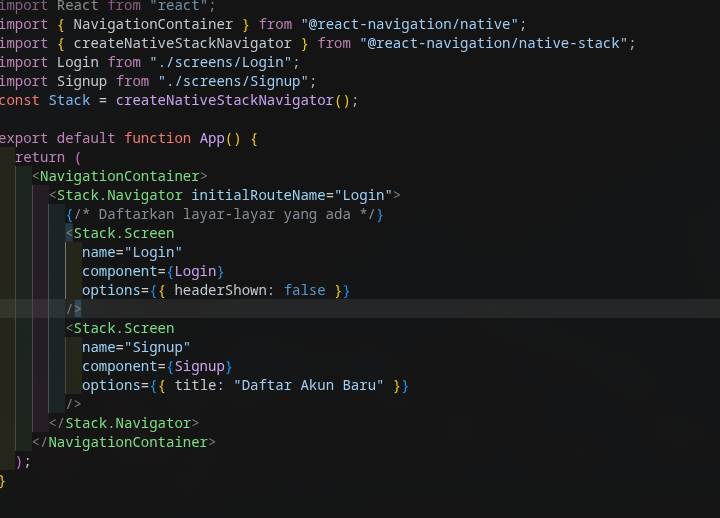
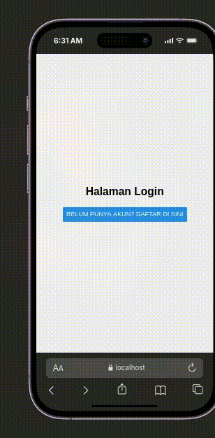
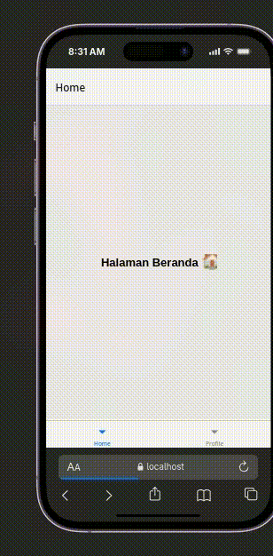

# Laporan Praktikum 4: Navigation di React Native

Langkah 1 : menginstall depedensi dan library yang dibutuhkan untuk membuat navigasi
1. install (npm install @react-navigation/native)
- 
2. install depedensi native(npx expo install react-native-screens react-native-safe-area-context react-native-gesture-handler react-native-reanimated)
- 

Langkah 2: membuat stack navigasi
1. instal library untuk stack navigasi(npm install @react-navigation/native-stack)
- 
2. login.js
- 
3. signup.js
- 
4. app.js
- 

- stack navigation

- bottom navigation

- drawer navigation

